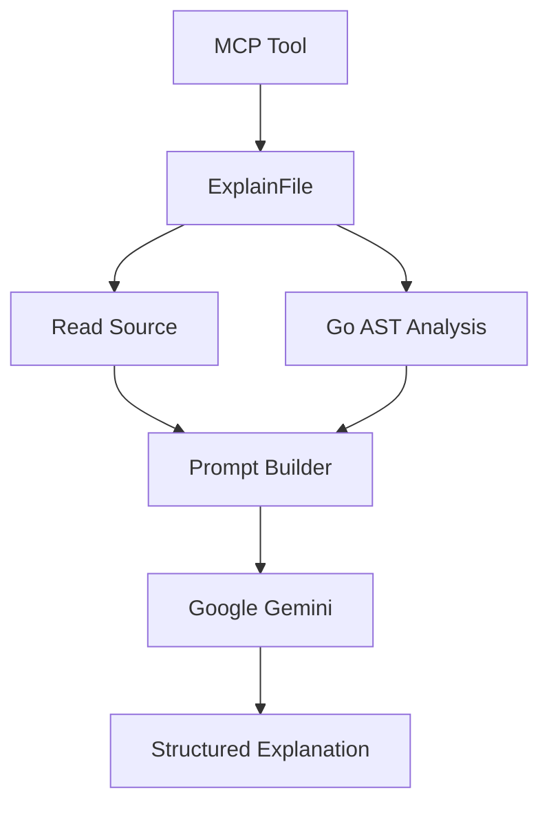

# Jarvis

> **AI-powered Go Developer Assistant** built with **Go** and the
> **Model Context Protocol (MCP)**.

Jarvis is an AI-powered Go developer assistant built as a Model Context
Protocol (MCP) server. It analyzes Go source code with the Go AST and
uses Google Gemini to generate structured, source-grounded explanations.

> 🚧 **Current Version:** **v0.5.2 (Beta)**

---

## Features

- Explain Go source files with Gemini through `explain_go_file`.
- Analyze packages, imports, functions, structs, methods, interfaces,
  and TODO comments.
- Browse a workspace with file reading, directory listing, file
  metadata, and glob-based file search.
- Use utility tools for greetings, addition, and weekday lookup.
- Return actionable errors for invalid paths, parse failures, missing
  files, and Gemini configuration failures.

---

## Architecture

```text
MCP Client
    │
    ▼
main.go (MCP Server)
    │
    ▼
tools/
    │
    ▼
internal/
 ├── analyzer/
 ├── gofile/
 └── ai/
    │
    ▼
Google Gemini API
```

The project follows a layered architecture where the `tools/` packages
expose MCP tools, while the `internal/` packages contain reusable
business logic independent of the transport layer.

---

## AI Workflow



`explain_go_file` validates the file path, reads the source code,
performs Go AST analysis, builds a structured prompt, and requests an
explanation from Gemini.

The generated explanation includes: - Purpose - High-Level Flow -
Important Types - Important Functions - External Dependencies -
Interesting Design Decisions - Possible Improvements

---

## Project Structure

```text
jarvis/
├── main.go
├── go.mod
├── README.md
├── internal/
│   ├── ai/
│   ├── analyzer/
│   └── gofile/
└── tools/
    ├── ai/
    ├── analyzer/
    ├── workspace/
    ├── greeting/
    ├── math/
    └── system/
```

---

## MCP Tools

---

Tool Description

---

`explain_go_file` Generate a structured AI explanation for a Go
file.

`analyze_go_file` Analyze a Go source file.

`analyze_imports` Extract import paths.

`read_file` Read a file (up to 1 MB).

`list_directory` List directory contents.

`find_files` Find files using glob patterns.

`file_info` Return file metadata.

`hello`, `bye`, `add`, Utility tools.
`weekday`

---

---

## Configuration

Set the `GEMINI_API_KEY` environment variable before using
`explain_go_file`.

Example:

```json
{
  "path": "internal/ai/gemini.go",
  "model": "gemini-3.5-flash"
}
```

---

## Development

```bash
go fmt ./...
go vet ./...
go test ./...
```

---

## Roadmap

### Completed

- ✅ MCP Foundation
- ✅ Workspace Tools
- ✅ Go AST Analysis
- ✅ AI-powered Go File Explanations

### Planned

- Git Intelligence
- AI Code Review
- Repository Analysis
- Multi-provider AI support

---

## Releases

Version Highlights

---

**v0.5.2** Documentation, GoDoc comments, polish and maintenance
**v0.5.1** AI-powered Go file explanations
**v0.5.0** Gemini integration
**v0.4.0** Go AST analysis
**v0.3.0** Workspace tools
**v0.2.0** Initial project setup & Core MCP tools

---

## Tech Stack

- Go
- Model Context Protocol (MCP)
- Google Gemini API
- Go AST

---

## License

This project is licensed under the MIT License.
