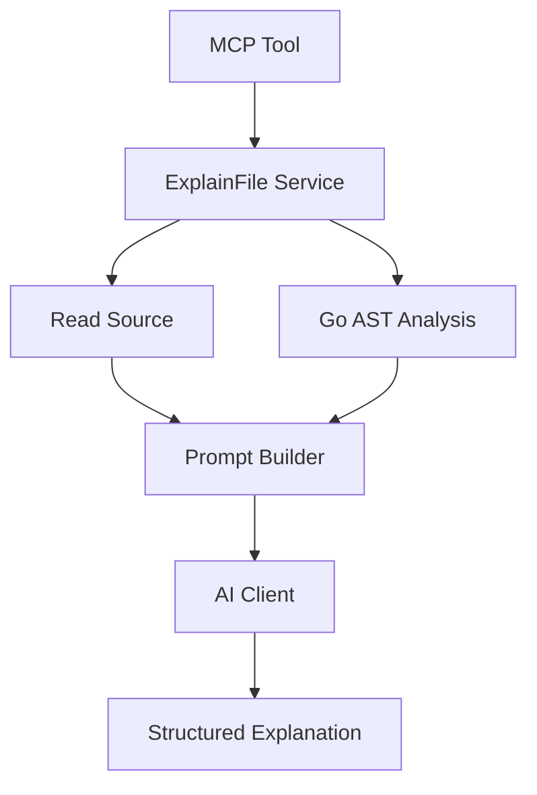
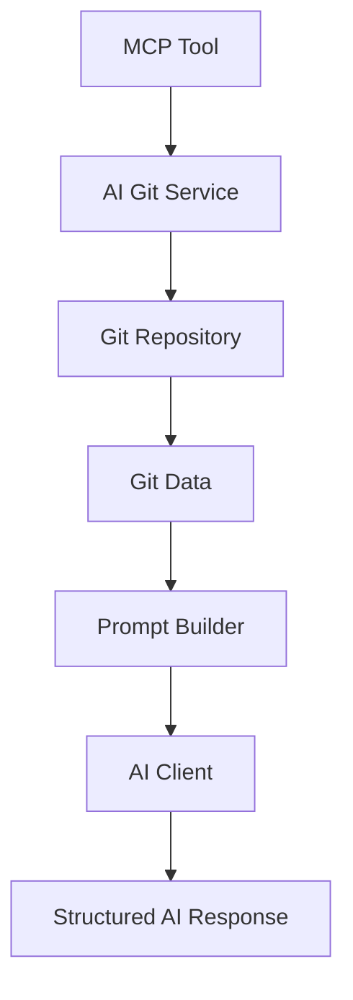

# Jarvis

> **AI-powered Go Developer Assistant** built with **Go** and the
> **Model Context Protocol (MCP)**.

Jarvis is an AI-powered Go developer assistant built as a Model Context
Protocol (MCP) server. It analyzes Go source code with the Go AST, provides
workspace and Git intelligence, and uses Google Gemini to generate
structured, source-grounded AI assistance.

> 🚀 **Current Version:** **v0.7.0**

---

## Features

### Go Source Analysis

- Explain Go source files with Gemini through `explain_go_file`.
- Analyze Go packages, imports, functions, structs, methods, interfaces,
  and TODO comments.
- Build reusable Go AST analysis functionality independent of the MCP layer.

### Workspace Tools

- Read files with a 1 MB size limit.
- List directory contents.
- Find files using glob patterns.
- Return file metadata.
- Handle invalid paths, missing files, directories, and other filesystem
  errors cleanly.

### Git Intelligence

Jarvis can inspect a Git repository through reusable Git services:

- Get the current branch with `git_current_branch`.
- Inspect repository status with `git_status`.
- List local branches with `git_branches`.
- Read commit history with `git_log`.
- Inspect individual commits with `git_show_commit`.
- View working-tree changes with `git_diff`.
- Analyze commit ranges for release-note generation.

### AI Git Intelligence

Jarvis can use the configured AI client to understand Git activity:

- Generate Conventional Commit messages with
  `git_generate_commit_message`.
- Explain commits with `git_explain_commit`.
- Review working-tree diffs with `git_review_diff`.
- Generate structured release notes with `git_release_notes`.
- Generate a repository-level summary with `git_repository_summary`.

The AI Git features use dependency injection, reusable prompt builders,
structured responses, and Git repository abstractions so that the AI
layer remains separate from Git and MCP transport concerns.

---

## Architecture

```text
MCP Client
    │
    ▼
main.go (MCP Server)
    │
    ▼
tools/
    │
    ├── workspace/
    ├── analyzer/
    ├── ai/
    └── git/
    │
    ▼
internal/
    ├── ai/
    │   ├── git/
    │   └── prompts/
    ├── analyzer/
    ├── git/
    └── gofile/
    │
    ├── Go AST
    ├── Git
    └── AI Client
          │
          ▼
    Google Gemini API
```

The project follows a layered architecture:

- `tools/` exposes MCP tools and handles transport-level input/output.
- `internal/` contains reusable business logic.
- `internal/analyzer/` provides Go AST analysis.
- `internal/git/` provides Git repository operations.
- `internal/ai/` provides AI client abstractions and AI services.
- `internal/ai/prompts/` contains reusable prompt builders.

This separation keeps the core functionality testable and independent of
the MCP transport layer.

---

## AI Workflow

### Go File Explanation


```mermaid
graph TD
A[MCP Tool] --> B[ExplainFile Service]
B --> C[Read Source]
B --> D[Go AST Analysis]
C --> E[Prompt Builder]
D --> E
E --> F[AI Client]
F --> G[Structured Explanation]
```

`explain_go_file` validates the file path, reads the source code, performs
Go AST analysis, builds a structured prompt, and requests an explanation
from the configured AI provider.

### AI Git Workflow


```mermaid
graph TD
A[MCP Tool] --> B[AI Git Service]
B --> C[Git Repository]
C --> D[Git Data]
D --> E[Prompt Builder]
E --> F[AI Client]
F --> G[Structured AI Response]
```

The AI Git services use Git data as the source material and ask the AI to
produce structured results such as commit messages, explanations, reviews,
release notes, and repository summaries.

---

## Project Structure

```text
jarvis/
├── main.go
├── go.mod
├── README.md
├── internal/
│   ├── ai/
│   │   ├── git/
│   │   └── prompts/
│   ├── analyzer/
│   ├── git/
│   └── gofile/
└── tools/
    ├── ai/
    ├── analyzer/
    ├── git/
    ├── workspace/
    ├── greeting/
    ├── math/
    └── system/
```

---

## MCP Tools

| Tool                          | Description                                           |
| ----------------------------- | ----------------------------------------------------- |
| `explain_go_file`             | Generate a structured AI explanation for a Go file.   |
| `analyze_go_file`             | Analyze a Go source file.                             |
| `analyze_imports`             | Extract import paths.                                 |
| `read_file`                   | Read a file up to 1 MB.                               |
| `list_directory`              | List directory contents.                              |
| `find_files`                  | Find files using glob patterns.                       |
| `file_info`                   | Return file metadata.                                 |
| `git_current_branch`          | Return the current Git branch.                        |
| `git_status`                  | Inspect repository status.                            |
| `git_branches`                | List local Git branches.                              |
| `git_log`                     | Read recent commit history.                           |
| `git_show_commit`             | Inspect a specific commit.                            |
| `git_diff`                    | Return the current working-tree diff.                 |
| `git_generate_commit_message` | Generate a Conventional Commit message using AI.      |
| `git_explain_commit`          | Explain a Git commit using AI.                        |
| `git_review_diff`             | Review current Git changes using AI.                  |
| `git_release_notes`           | Generate structured release notes for a commit range. |
| `git_repository_summary`      | Generate an AI summary of the repository state.       |
| `hello` / `bye`               | Greeting utility tools.                               |
| `add`                         | Addition utility tool.                                |
| `weekday`                     | Weekday utility tool.                                 |

---

## Configuration

Set the `GEMINI_API_KEY` environment variable before using the Gemini
powered AI features.

Example:

```text
GEMINI_API_KEY=<your-api-key>
```

The AI layer is designed around an injectable client abstraction, allowing
the application to evolve toward additional AI providers without coupling
Git or MCP tools directly to a specific provider.

---

## Development

Format the project:

```bash
go fmt ./...
```

Run static analysis:

```bash
go vet ./...
```

Run all tests:

```bash
go test ./...
```

---

## Roadmap

### Completed

- ✅ MCP Foundation
- ✅ Workspace Tools
- ✅ Go AST Analysis
- ✅ AI-powered Go File Explanations
- ✅ Git Intelligence
- ✅ AI-powered Git Intelligence

### Next

- Repository 1 final hardening and portfolio polish
- Evaluate remaining capabilities required for the `v1.0.0` milestone
- Continue with Repository 2 after Repository 1 reaches its portfolio-ready
  milestone

---

## Releases

| Version    | Highlights                                                                                                               |
| ---------- | ------------------------------------------------------------------------------------------------------------------------ |
| **v0.7.0** | AI-powered Git intelligence: commit messages, commit explanations, diff review, release notes, and repository summaries. |
| **v0.6.0** | Git intelligence and repository inspection tools.                                                                        |
| **v0.5.2** | Documentation, GoDoc comments, polish, and maintenance.                                                                  |
| **v0.5.1** | AI-powered Go file explanations.                                                                                         |
| **v0.5.0** | Gemini integration.                                                                                                      |
| **v0.4.0** | Go AST analysis.                                                                                                         |
| **v0.3.0** | Workspace tools.                                                                                                         |
| **v0.2.0** | Initial project setup and core MCP tools.                                                                                |

---

## Tech Stack

- Go
- Model Context Protocol (MCP)
- Google Gemini API
- Go AST
- Git / go-git

---

## License

This project is licensed under the MIT License.
